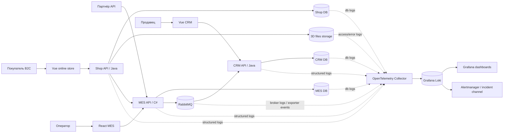

# Архитектурное решение по логированию

## Что логируем

Логирование нужно покрыть там, где заказ меняет состояние, проходит через интеграции или может зависнуть:

- онлайн-магазин и Shop API: создание заказа, загрузка 3D-файла, отправка заказа на расчёт;
- партнёрский API на стороне MES: приём заказа от внешних продавцов, валидация модели, постановка расчёта в обработку;
- MES API и MES workers: расчёт стоимости, работа операторов, изменение производственных статусов, загрузка первой страницы MES;
- CRM API: создание заказа из сообщения, подтверждение производства, закрытие заказа;
- RabbitMQ: публикация, потребление, повторная доставка, nack и DLQ;
- базы данных Shop, CRM и MES: ошибки записи, медленные запросы, deadlock, превышение пула соединений;
- файловое хранилище 3D-моделей: загрузка, чтение, ошибки доступа.

Схема сбора логов:



Все прикладные логи должны быть структурированными JSON-записями с обязательными полями:

- `timestamp`, `level`, `service`, `environment`, `version`;
- `trace_id`, `span_id`, `correlation_id`;
- `order_id`, если операция относится к заказу;
- `source`: `b2c`, `partner_api`, `crm`, `mes`;
- `partner_id`, если заказ пришёл от партнёра;
- `operation`, `result`, `duration_ms`;
- `error_code` и `exception_type` для ошибок.

Персональные данные, платёжные данные, адреса доставки, содержимое 3D-файлов и полный текст пользовательских комментариев в логи не пишем.

## INFO-логи

На уровне `INFO` фиксируем бизнес-события и важные технические события, по которым поддержка сможет восстановить путь заказа без доступа к БД.

| Система | Событие | Основные поля |
| --- | --- | --- |
| Shop API | Создан заказ `INITIATED` | `order_id`, `customer_id_hash`, `source=b2c`, `cart_items_count` |
| Shop API | 3D-файл загружен `FILE_UPLOADED` | `order_id`, `file_id`, `file_size_bucket`, `model_complexity_bucket`, `duration_ms` |
| Shop API | Заказ отправлен `SUBMITTED` | `order_id`, `customer_id_hash`, `correlation_id`, `submitted_at` |
| Shop API | Запрос расчёта цены передан в MES | `order_id`, `request_id`, `target_service=mes`, `result`, `duration_ms` |
| MES API | Партнёрский заказ принят | `order_id`, `partner_id`, `request_id`, `rate_limit_bucket`, `result` |
| MES API | Партнёрский заказ отклонён валидацией | `partner_id`, `request_id`, `validation_error_code`, `file_size_bucket` |
| MES worker | Расчёт цены начат | `order_id`, `worker_id`, `polygon_bucket`, `queue_age_ms` |
| MES worker | Расчёт цены завершён `PRICE_CALCULATED` | `order_id`, `price_bucket`, `duration_ms`, `result` |
| MES API | Оператор взял заказ `MANUFACTURING_STARTED` | `order_id`, `operator_id_hash`, `previous_status`, `new_status` |
| MES API | Производство завершено `MANUFACTURING_COMPLETED` | `order_id`, `operator_id_hash`, `duration_ms` |
| MES API | Упаковка начата `PACKAGING` | `order_id`, `operator_id_hash` |
| MES API | Заказ отправлен `SHIPPED` | `order_id`, `delivery_provider`, `tracking_id_hash` |
| CRM API | Заказ создан из сообщения MES | `order_id`, `message_id`, `queue`, `result` |
| CRM API | Производство подтверждено `MANUFACTURING_APPROVED` | `order_id`, `seller_id_hash`, `previous_status`, `new_status` |
| CRM API | Заказ закрыт `CLOSED` | `order_id`, `close_reason`, `actor_type` |
| RabbitMQ producer | Сообщение опубликовано | `order_id`, `message_id`, `exchange`, `routing_key`, `event_type` |
| RabbitMQ consumer | Сообщение обработано | `order_id`, `message_id`, `queue`, `event_type`, `duration_ms` |
| RabbitMQ consumer | Сообщение отправлено на повтор | `order_id`, `message_id`, `queue`, `retry_count`, `reason` |
| RabbitMQ consumer | Сообщение отправлено в DLQ | `order_id`, `message_id`, `queue`, `dlq`, `reason` |
| MES API | Главная страница MES открыта | `operator_id_hash`, `status_filter`, `page_size`, `duration_ms`, `cache_result` |

## Другие уровни логирования

- `DEBUG`: временно включается для отдельного `correlation_id`, `order_id` или партнёра при расследовании. По умолчанию выключен в production, чтобы не раскрывать лишние данные и не увеличивать стоимость хранения.
- `WARN`: деградация без немедленного отказа. Например, медленный запрос к БД, превышение обычного времени расчёта, retry сообщения, cache miss rate выше нормы, близкое исчерпание пула соединений.
- `ERROR`: операция завершилась ошибкой и требует реакции: HTTP 5xx, ошибка записи статуса, недоступность RabbitMQ, ошибка чтения 3D-файла, невозможность обработать сообщение после retry.
- `FATAL`: сервис не может продолжать работу: не стартует приложение, недоступна обязательная БД на старте, повреждена конфигурация подключения к брокеру.

## Мотивация

Сейчас команда разбирает инциденты со слов клиента и вручную ищет следы в разных системах. Централизованные структурированные логи дадут поддержку и разработчикам единый способ ответить на вопросы: был ли заказ создан, где он изменил статус, какое сообщение ушло в очередь, какой сервис вернул ошибку и кто должен чинить проблему.

Ожидаемый эффект:

- снизится MTTR по инцидентам с заказами;
- уменьшится число обращений, которые требуют подключения разработчика;
- повысится доля заказов, по которым поддержка может дать ответ за первый контакт;
- уменьшится число заказов в неизвестном состоянии;
- появится доказательная база для SLA партнёрского API и внутренних SLA между CRM и MES.

Логирование и трейсинг нужно внедрять поэтапно. В первую очередь покрываем MES API, MES workers, RabbitMQ и CRM API, потому что именно там появляются жалобы на потерянные и просроченные заказы после открытия партнёрского API. Вторым этапом покрываем Shop API и файловое хранилище, чтобы видеть B2C-путь до передачи заказа в MES. Фронтенд-логи добавляем точечно для критичных пользовательских действий, но не делаем их первым приоритетом: основные проблемы сейчас на серверной стороне и в интеграциях.

## Предлагаемое решение

### Технологии

Используем Grafana Loki как хранилище логов, Grafana для поиска и дашбордов, OpenTelemetry Collector или Grafana Alloy как единый агент доставки. Такой выбор хорошо стыкуется с уже запланированными Prometheus/Grafana и OpenTelemetry для метрик и трейсинга.

Для приложений:

- Java Spring Boot: Logback JSON encoder, MDC для `trace_id`, `correlation_id`, `order_id`, экспорт через OpenTelemetry Collector;
- C# MES: Serilog с JSON formatter и enrichment полями `trace_id`, `order_id`, `correlation_id`;
- RabbitMQ: включить broker logs, management metrics и прикладные логи producer/consumer;
- базы данных: включить slow query log и error log, не логировать значения параметров, если они содержат персональные данные;
- фронтенды: отправлять только ошибки критичных пользовательских сценариев через backend endpoint с rate limit.

### Формат и корреляция

Во всех сервисах вводится единый `correlation_id`. Для HTTP он передаётся в заголовке `X-Correlation-ID`, для RabbitMQ - в headers сообщения. При создании заказа генерируется `order_id`; дальше он обязателен во всех логах операций заказа. `trace_id` берём из OpenTelemetry context, чтобы Grafana могла связать логи с трейсами.

Логи должны быть машинно-читаемыми. Пример:

```json
{
  "timestamp": "2026-05-29T10:15:30.120Z",
  "level": "INFO",
  "service": "mes-api",
  "environment": "prod",
  "trace_id": "6b1f...",
  "correlation_id": "ord-flow-8f3a",
  "order_id": "ALEX-100245",
  "operation": "status_change",
  "previous_status": "PRICE_CALCULATED",
  "new_status": "MANUFACTURING_APPROVED",
  "result": "success",
  "duration_ms": 42
}
```

### Безопасность

- Доступ к Grafana/Loki только через VPN или корпоративную сеть.
- Аутентификация через SSO, роли: `support-read`, `developer-read`, `devops-admin`, `security-audit`.
- Поддержка видит только production-логи по заказам и не видит технические секреты.
- Разработчики имеют read-only доступ к production-логам; расширенный доступ выдаётся временно на инцидент.
- В логи запрещено писать ФИО, телефон, email, адрес, платёжные данные, исходные 3D-файлы, токены и пароли.
- `customer_id`, `operator_id`, `seller_id`, `tracking_id` пишем в хешированном виде.
- На входе в Collector добавляем правила маскирования: email, телефон, bearer token, cookie, card-like numbers.
- Все запросы к логам аудитируются: кто искал, по какому периоду и по каким фильтрам.

### Хранение

Логи разделяются по окружениям `dev`, `release`, `prod` и по сервисам через labels `environment`, `service`, `level`. Для Loki важно не делать высококардинальные labels: `order_id`, `customer_id`, `trace_id` остаются полями лога, а не labels.

Отдельные физические индексы под каждую систему в Loki не заводим: это не поисковый индекс в стиле OpenSearch/Elasticsearch. Вместо этого используем логическое разделение по tenant/labels и отдельные retention-правила для `prod`, `release`, `dev` и `security-audit`. Если позже команда перейдёт на OpenSearch, аналогом будут индексы `prod-mes-*`, `prod-crm-*`, `prod-shop-*`, `prod-rabbitmq-*`.

Политика хранения:

- production hot storage: 30 дней в Loki;
- production archive: 180 дней в Object Storage в сжатом виде для расследований и спорных ситуаций;
- release: 14 дней;
- dev: 7 дней;
- security/audit logs: 1 год отдельно, доступ только DevOps и security-аудиту;
- лимит ingestion на старте: 30 GB/сутки для production с алертом при 80% лимита;
- стартовые бюджеты объёма: MES до 12 GB/сутки, CRM до 6 GB/сутки, Shop до 6 GB/сутки, RabbitMQ и инфраструктура до 6 GB/сутки;
- ERROR и WARN сохраняются в архив полностью, INFO можно семплировать для высокочастотных технических событий, но не для событий статусов заказа.

## Анализ логов, алертинг и аномалии

Логирование должно стать не только хранилищем, но и системой анализа.

Алерты:

- `ERROR` по изменению статуса заказа больше 5 раз за 10 минут;
- любое сообщение заказа попало в DLQ;
- рост `WARN retry` по RabbitMQ выше базового уровня;
- `ERROR` от партнёрского API для одного `partner_id` выше 5% за 15 минут;
- `duration_ms` главной страницы MES выше 3 секунд p95 по логам доступа;
- нет INFO-событий `PRICE_CALCULATED` при наличии новых `SUBMITTED` дольше 30 минут;
- всплеск HTTP 5xx в Shop API, CRM API или MES API.

Аномалии:

- резкий рост создания заказов: например, больше 10 000 заказов за минуту вместо обычных единиц или десятков;
- рост заказов от одного партнёра выше квоты;
- много одинаковых validation errors по 3D-файлам от одного источника;
- нетипичный рост cache miss на MES-дашборде;
- много ручных закрытий заказов в CRM за короткое время.

Для реакции на аномалии нужны runbook-и: ограничить партнёра rate limit, проверить очередь, открыть DLQ, найти `correlation_id`, повторить обработку сообщения, создать инцидент и уведомить поддержку.

## Критерии выбора технологии

| Критерий | Grafana Loki | OpenSearch | ELK / Elastic Stack | Splunk |
| --- | --- | --- | --- | --- |
| Лицензия и стоимость | OSS/AGPL, низкая стоимость хранения при правильных labels | Apache 2.0, можно развернуть самостоятельно | Elastic License, часть функций платная | Проприетарная, высокая стоимость |
| Интеграция с метриками и трейсами | Очень сильная интеграция с Grafana, Prometheus, Tempo | Требует отдельной интеграции с Grafana/OpenTelemetry | Хорошая экосистема, но отдельный стек | Сильная аналитика, но отдельный дорогой стек |
| Полнотекстовый поиск | Достаточный для структурированных логов, хуже поисковых движков | Сильный полнотекстовый поиск | Сильный полнотекстовый поиск | Очень сильный поиск и аналитика |
| Эксплуатационная сложность | Ниже при небольшом количестве labels | Средняя/высокая, нужно управлять индексами | Средняя/высокая, нужны Elasticsearch и Kibana | Низкая для пользователей, но высокая зависимость от вендора |
| Стоимость хранения | Низкая: индексирует labels, данные хранит сжатыми | Выше из-за индексации | Выше из-за индексации | Высокая и зависит от объёма ingestion |
| Подходит для текущей команды | Да: один DevOps, уже выбран Grafana-стек | Возможно, если нужен мощный поиск | Возможно, но тяжелее сопровождать | Слишком дорого и избыточно для текущего этапа |
| Маскирование и пайплайны | Через Collector/Alloy pipeline | Через ingest pipelines | Через ingest pipelines | Богатые встроенные возможности |

Выбор: Grafana Loki. Для «Александрита» важнее быстро получить централизованные структурированные логи, связать их с метриками и трейсами и не перегрузить команду эксплуатацией. OpenSearch или Elastic можно рассмотреть позже, если появится потребность в сложной поисковой аналитике по большим объёмам текстовых логов.
