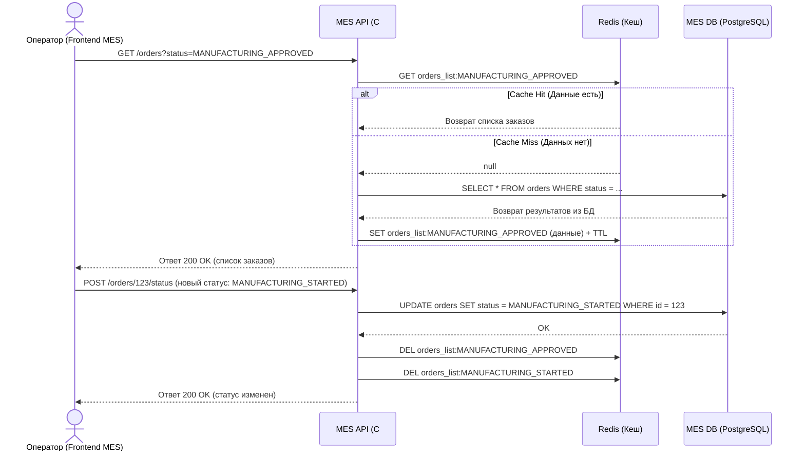

# Задание 5. Архитектурное решение по кешированию

## 1. Анализ
Главная боль операторов MES — долго прогружающаяся первая страница (дашборд со списком заказов по статусам). Также расчет цены может занимать 2-30 минут. 
Кешировать результаты расчетов цен 3D-моделей пока нецелесообразно, так как в B2C большинство заказов уникальны (однако для B2B каталога это может стать актуальным позже).
**Решение:** Имеет смысл закешировать выдачу списка заказов по статусам (в частности: `MANUFACTURING_APPROVED`, `MANUFACTURING_STARTED` и т.д.) для первой страницы MES.

## 2. Мотивация
*Почему нужно внедрить кеширование:* PostgreSQL в MES не справляется со сложными аналитическими и списочными запросами при возросшей нагрузке. Из-за этого операторы медленно получают новые заказы, что демотивирует их (так как оплата сдельная) и затягивает сроки производства для клиентов.
Внедрение кеширования снизит нагрузку на основную базу данных и сократит время ответа MES API с нескольких секунд до миллисекунд (latency < 50ms). Это вернет операторам комфортные условия работы и ускорит бизнес-процесс "взятия заказа в работу".

## 3. Предлагаемое решение
*Тип кеширования:* **Серверное кеширование (Server-side caching)** с использованием in-memory БД, такой как Redis (например, Yandex Managed Service for Redis).
*Почему серверное:* Клиентское кеширование (в браузере оператора) не подойдет, так как данные (список доступных заказов) очень динамичны и изменяются *другими* операторами. Если один оператор взял заказ, он должен моментально исчезнуть у остальных.

*Паттерн кеширования:* **Cache-Aside** (Lazy Loading).
*Обоснование:*
- Приложение сначала ищет список заказов в Redis. Если его там нет (Cache Miss), оно запрашивает данные из PostgreSQL, кладет их в Redis и отдает клиенту.
- Этот паттерн идеально подходит для систем с преобладанием чтения (Read-heavy, как дашборд MES).
- Его гораздо проще внедрить в существующий (legacy) код на C#, чем `Write-Through` (который требует переписывания всех транзакций записи).

## 4. Диаграмма последовательности (Sequence Diagram)
Процесс чтения списка заказов и изменения статуса с инвалидацией.

## 5. Стратегия инвалидации кеша
*Предлагаемая стратегия:* **Программная инвалидация (по ключу) в комбинации с TTL (Time-To-Live)**.

*Обоснование:*
1. **Программная инвалидация:** При любом изменении статуса заказа (создан, взят в работу оператором, закрыт), MES API программно и явно удаляет (`DEL`) ключи списка для старого и нового статуса. Это гарантирует строгую консистентность: следующий оператор, запросивший дашборд, гарантированно получит свежие данные (спровоцирует Cache Miss и запрос в БД).
2. **TTL (Time-To-Live):** Используется как защитный механизм (Fallback). Ключи в кеше создаются с коротким TTL (например, 1-2 минуты). Если программная инвалидация по какой-либо причине не отработала (сбой сети, падение инстанса), старые данные не зависнут в кеше навсегда, а протухнут через минуту.

*Сравнительный анализ:*
| Стратегия | Плюсы | Минусы | Почему подходит / не подходит |
|---|---|---|---|
| Только TTL (Временная) | Крайне простая реализация. Не нужно трогать логику обновления заказов. | Данные могут быть устаревшими (Stale). Операторы могут видеть "фантомные" заказы, которые уже взяли другие. | **Не подходит** как основная. В конкурентной среде операторов приведет к ошибкам (два оператора берут один заказ). |
| Программная (по ключу) | Обеспечивает немедленную консистентность. Операторы видят 100% актуальную информацию. | Требует изменения логики приложения при операциях записи/обновления (UPDATE). | **Идеально подходит** для MES, так как позволяет избежать гонки за заказы. |
| Write-Through | Данные в кеше обновляются синхронно с базой. Нет Cache Miss. | Увеличивает задержку (latency) при записи. Сложно внедрить в унаследованный код. | Избыточно для кеширования пагинированных списков. |